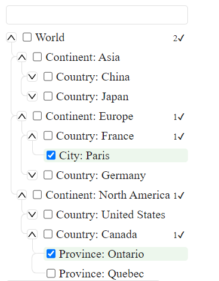
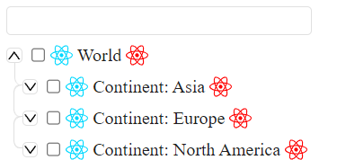
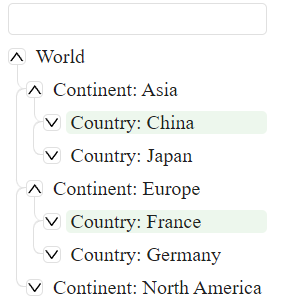
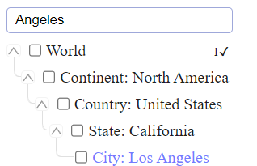

# **React Tree Select Component**

The React Tree Select component is a flexible and customizable tree select component built with React. It allows you to
create a hierarchical select input with checkboxes.

To use the React Tree Select component in your project, you need to import it from its location in your project:

````
import { ReactTreeSelect } from './react-tree-select.tsx';
````

**Base view:**



**With custom icons:**



**Hide checkbox and selected child count:**



**Search mode:**



**Props**

The React Tree Select component accepts the following props:

1. tree: An array of objects that represent the hierarchical data that you want to display. Each object should have the
   following properties:

*     id: A unique identifier for the item.
*     label: The display text for the item.
*     children: An array of objects that represent the child items of the current item.
*     expanded: A boolean that determines whether the child items of the current item are visible or not.

1. onChange: A function that is called when the selected items change. It receives the selected items as its argument.
2. selectedIds: An array of the id values of the items that should be selected by default.
3. renderIconBefore: A React element that will be rendered before the item label.
4. renderIconAfter: A React element that will be rendered after the item label.
5. targetNodeId: The id of the DOM element where the component will be rendered.
6. hideCheckbox: A boolean that determines whether the checkboxes should be hidden or not.
7. hideSelectedChildCount: A boolean that determines whether the count of selected child items should be hidden or not.

**Usage**

Here is an example of how to use the React Tree Select component:

```
import React from 'react'
import ReactDOM from 'react-dom'
import { ReactTreeSelect } from './react-tree-select.tsx';
import { TreeSelectItems, TreeSelectProps } from './types';

const mockTree:TreeSelectItems[] = [{
id: 'world',
label: 'World',
children: [
{
id: 'continent-1',
label: 'Continent: Asia',
expanded: true,
children: ...
}];

const mockProps = {
tree: mockTree,
onChange: (el) => {
console.log(el);
},
selectedIds: [],
renderIconBefore: <div>Icon Before</div>,
renderIconAfter: <div>Icon After</div>
}

ReactDOM.render(
<React.StrictMode>
// dom element where component will be rendered
<div id={'TreeSelect'}></div>
<ReactTreeSelect {...mockProps} targetNodeId={'TreeSelect'} selectedIds={['city-2-1-1']}/>
</React.StrictMode>,
document.getElementById('root')
);
```

I'm not designer sorry :) but you can reassign colors using CSS variables like these:

```
--tree-label-hover-color: rgba(0, 0, 0, 0.1);
--tree-label-blue-color: #747bff;
--tree-borders-color: #E0E0E0;
--tree-input-hover: #9FA8DA;
--tree-active-label-color: rgba(76, 175, 80, 0.1);
--tree-default-label-color: #212121;
--tree-empty-background: rgba(63, 61, 61, 0.6);
```

In this example, mockTree is the hierarchical data that you want to display, and mockProps are the props that you pass
to the React Tree Select component. The onChange prop is a function that logs the selected items when they change. The
renderIconBefore and renderIconAfter props are React elements that are rendered before and after the item label,
respectively. Please adjust the documentation according to your needs.
